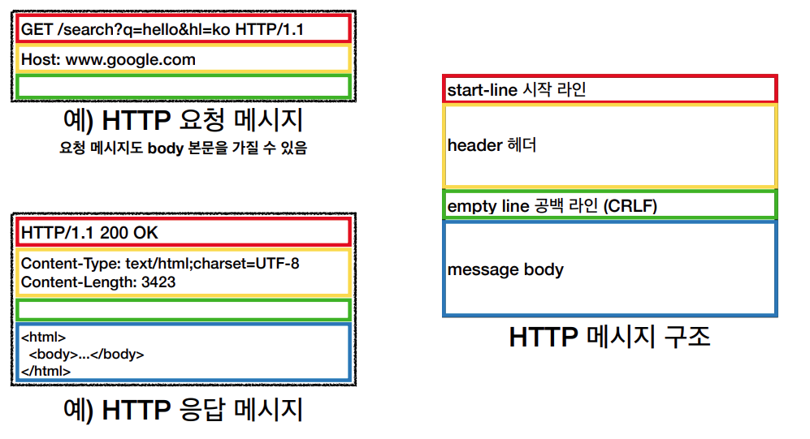

# HTTP 메시지

## HTTP 메시지 구조



## 시작 라인
요청 메시지
```
GET /search?q=hello&hl=ko HTTP/1.1
Host: www.google.com
```


- start-line = **request-line** / status-line
- **request-line** = method (공백) request-target (공백) HTTP-version (엔터)

- **HTTP 메서드** (GET: 조회, POST: 처리) (서버가 수행할 동작 지정)
- **요청 대상** (/search?q=hello&hl=ko) (절대경로[?쿼리스트링], 절대경로 "/" 로 시작)
- HTTP -v : HTTP/1.1


응답 메시지
```
HTTP/1.1 200 OK
Content-type: text/html;charset=UTF-8
Content-length: 3433

<html>
    <body>...</body>
</html>
```

- start-line = request-line / **status-line**
- **status-line** = HTTP-version (공백) 상태코드 (공백) reason-phrase (엔터)

- HTTP 버전
- HTTP 상태 코드 : 요청 성공, 실패를 나타냄
    - 200 성공
    - 400 클라이언트 요청 오류
    - 500 서버 내부 오류
- 이유 문구: 사람이 이해할 수 있는 짧은 상태 코드 설명 글


## HTTP 헤더

- Header-field = field-name : OWS field-value OWS (OWS: 띄어쓰기 허용)

- field-name은 대소문자 구문 없음

### HTTP 헤더 용도

- HTTP 전송에 필요한 모든 부가 정보가 다 들어가 있다.

- 메시지 바디의 내용, 메시지 바디의 크기, 압축, 인증, 요청 클라이언트(브라우저) 정보, 서버 애플리케이션 정보, 캐시 관리 정보

- 표준 헤더가 너무 많음 (따로 정리)

- 필요시 임의의 헤더 추가 가능
    - HelloWorld: hihi

## HTTP 메시지 바디

- 실제 전송할 데이터
- HTML 문서, 이미지, 영상, JSON 등등 byte로 표현할 수 있는 모든 데이터 전송 가능

## 정리

- http는 단순
- http 메시지도 매우 단순
- 크게 성공하는 표준 기술은 단순하지만 확장 가능한 기술