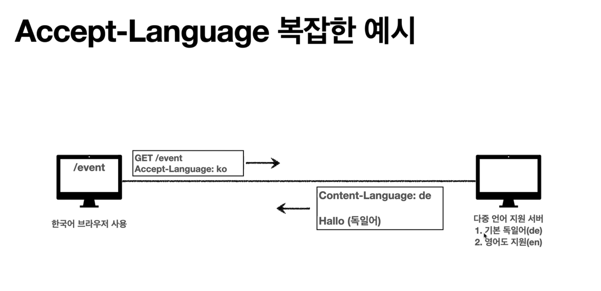

# HTTP 헤더 개요

## 용도

- HTTP 전송에 필요한 모든 부가정보
- 예) 메시지 바디의 내용, 메시지 바디의 크기, 압축, 인증, 요청 클라이언트, 서버 정보, 캐시 관리 정보,...
- 표준 헤더가 너무 많음
    - [https://en.wikipedia.org/wiki/List of HTTP header fields](https://en.wikipedia.org/wiki/List_of_HTTP_header_fields)

- 필요시 임의의 헤더 추가 가능
    - helloworld: hihi


## HTTP 표준 스펙이 바뀐다

- 1999년 RFC2616 (폐기됨)
    - 엔티티 헤더, 엔티티 바디,...
- 2014년 RFC7230 ~ 7235 등장

## RFC723x 변화점

- `엔티티(Entity)` -> `표현(Representation)`
- Representation = representation Metadata + Representation Data
- `표현` = `표현 메타데이터` + `표현 데이터`

## HTTP BODY
message body - RFC7230(최신)


- 메시지 본문(message body)을 통해 표현 데이터 전달
- 메시지 본문 = 페이로드 (payload)
- **표현**은 요청이나 응답에서 전달할 실제 데이터 (포현 = 표현헤더 + 표현데이터)
- **표현 헤더는 표현 데이터**를 해석할 수 있는 정보 제공 
    - 데이터 유형(html, json), 데이터 길이, 압축 정보 등등

- 참고: 표현 헤더는 표현 메타데이터와 페이로드 메시지를 구분해야 하지만 그러면 너무 복잡해져서... 생략


# 표현

- `Content-Type` : 표현 데이터의 형식
- `Content-Encoding` : 표현 데이터의 압축 방식
- `Content-Language` : 표현 데이터의 자연 언어
- `Content-Length` : 표현 데이터의 길이

---
- 표현 헤더는 전송, 응답 둘다 사용!

## Content-Type 표현 데이터의 형식 설명

- 미디어 타입, 문자 인코딩
- 예.
    - `text/html; charset=utf-8`
    - `application/json` (utf-8 기본)
    - `image/png`


## Content-Encoding 표현 데이터 인코딩

- 표현 데이터를 압축하기 위해 사용
- 데이터를 전달하는 곳에서 압축 후 인코딩 헤더 추가 (예를 들면 서버에서 압축 후 클라이언트에서 어떻게 압축된건지 알 수 있다)
- 데이터를 읽는 쪽에서 인코딩 헤더의 정보로 압축 해제
- 예.
    - gzip
    - deflate
    - identity (압축 안한다는 것!)


## Content-Language 표현 데이터의 자연 언어

```
HTTP/1.1 200 OK
Content-Type: text/html;charset=UTF-8
Content-Language: ko // 본문에 한국어가 들어가있구나!
Content-Length: 521

<html>
    <body>
        안녕하십니까
    </body>
</html>
```

- 예.
    - ko
    - en
    - en-US

## Content-Length 표현 데이터의 길이
- 바이트 단위
- **Transfer-Encoding**(전송 코딩)을 사용하면 Content-Length를 사용하면 안됨


# 협상 (콘텐츠 니고시에이션)
> 클라이언트가 선호하는 표현 요청

- Accept : 클라이언트가 선호하는 미디어 타입 전달
- Accept-Charset : 클라이언트가 선호하는 문자 인코딩
- Accept-Encoding : 클라이언트가 선호하는 압축 인코딩
- Accept-Language : 클라이언트가 선호하는 자연 언어

---

- 협상 헤더는 요청시에만 사용!



- 한국어를 요청했지만 기본이 독일어, 차선이 영어인 경우!
- 독일어 보낼바에 영어로 줘~

이런 상황...

## 협상과 우선순위 1 Quality Values(q)

```
GET /event
Accept-Language: ko-KR,ko;q=0.9,en-US;q=0.8,en;q=0.7
```

- Quality Values(q) 값 사용
- 0 ~ 1, 클수록 우선순위 높다
- 생략하면 1
- `Accept-Language: ko-KR,ko;q=0.9,en-US;q=0.8,en;q=0.7`
    - 1. ko-KR;q=1(생략)
    - 2. ko;q=0.9
    - 3. en-US;q=0.8
    - 4. en;q=0.7


## 협상과 우선순위 2

- 구체적인 것이 우선한다.

```
GET /event
Accept: text/*, text/plain, text/plain;format=flowed, */*
```

- Accept: text/*, text/plain, text/plain;format=flowed, */*

    1. `text/plain;format=flowed`

    2. `text/plain`

    3. `text/*`

    4. `*/*`


# 전송 방식

- Transfer-Encoding
- Range, Content-Range

## 전송 방식 설명

- 단순 전송
    - 한번에 요청하고 한번에 쭉 받는것!
    - Content-Length가 정해져있다.
```
HTTP/1.1 200 OK
Content-Type: text/html;charset=UTF-8
Content-Length: 3423

<html>
    <body>
        ...
    </body>
</html>
```
- 압축 전송
```
HTTP/1.1 200 OK
Content-Type: text/html;charset=UTF-8
Content-Encoding: gzip
Content-Length: 3423

kjh1234hjsfhoaosdfhj3234j2h3jaskdflasdfjh
```
- 분할 전송 (Transfer-Encoding)
    - 쪼개서 보낸다 (Content-Length를 보내면 안된다. 예상이 안된다.)
```
HTTP/1.1 200 OK
Content-Type: text/plain
Transfer-Encoding: chunked

5 // byte
Hello
5
World
0 // 끝
\r\n
```
- 범위 전송 (Range, Content-Range)

    - 클라이언트 요청
    ```
        GET /event
        Range: bytes=1001-2000
    ```

    - 서버 응답
    ```
        HTTP/1.1 200 OK
        Content-Type: text/plain
        Content-Range: bytes 1001-2000 / 2000

        sakjdfklfj23k4j3k2l4jlkasdfslkad234
    ```


# 일반 정보

- From: 유저 에이전트의 이메일 정보
    - 일반적으로 잘 사용되지 않음
    - 검색 엔진 같은 곳에서, 주로 사용
    - 요청에서 사용
- Referer: 이전 웹 페이지 주소
    - 현재 요청된 페이지의 이전 웹 페이지 주소
    - A -> B로 이동하는 경우 B를 요청할 때 Referer: A를 포함해서 요청
    - **Referer를 사용해서 유입 경로 분석 가능**
    - 요청에서 사용
    - 참고: referer는 단어 referrer의 오타
- User-Agent: 유저 에이전트 애플리케이션 정보
    - 클라이언트의 애플리케이션 정보(웹 브라우저 정보, 등등)
    - 통계 정보
    - 어떤 종류의 브라우저에서 장애가 발생하는지 파악 가능
    - 요청에서 사용
- Server: 요청을 처리하는 오리진 서버의 소프트웨어 정보
    - Server: Apache/2.2.22 (Debian)
    - server: nginx
    - 응답에서 사용
- Date: 메시지가 생성된 날짜
    - Date: Tue, 15 Nov 1994 08:12:31 GMT
    - 응답에서 사용


# 특별한 정보

## Host 요청한 호스트 정보(도메인)

```
GET /search?q=hello&hl=ko HTTP/1.1
Host: www.google.com
```

- 요청에서 사용
- 필수
- 하나의 서버가 여러 도메인을 처리해야 할 때
- 하나의 IP 주소에 여러 도메인이 적용되어 있을 때


## Location 페이지 리다이렉션

- 웹 브라우저는 3xx 응답의 결과에 `Location` 헤더가 있으면, `Location` 위치로 자동 이동(리다이렉트)

- 응답코드 3xx에서 설명

- 201 (Created): `Location`값은 요청에 의해 생성된 리소스 URI

- 3xx (Redirection): `Location`값은 요청을 자동으로 리다이렉션하기 위한 대상 리소스를 가리킴

## Allow 허용 가능한 HTTP 메서드

- 405(Method Not Allowed) 에서 응답에 포함해야함

- Allow: GET, HEAD, PUT

- 이런 거 있구나 참고만 합니다.


## Retry-After 유저 에이전트가 다음 요청을 하기까지 기다려야 하는 시간

- 503(Service Unavailable): 서비스가 언제까지 불능인지 알려줄 수 있음

- Retry-After: Fri, 31 Dec 1999 23:59:59 GMT (날짜 표기)

- Retry-After: 120 (초단위 표기)

- 이것또한 사용하기 쉽지 않다.


# 인증 헤더

- `Authorization`: 클라이언트 인증 정보를 서버에 전달

- `WWW-Authenticate`: 리소스 접근시 필요한 인증 방법 정의

    - 리소스 접근시 필요한 인증 방법 정의
    - `401 Unauthorized` 응답과 함께 사용


# 쿠키

- `Set-Cookie` : 서버에서 클라이언트로 쿠키 전달 (응답)

- `Cookie` : 클라이언트가 서버에서 받은 쿠키를 저장하고, HTTP 요청시 서버로 전달

## (복습) Stateless

- `HTTP`는 무상태(stateless) 프로토콜이다.
- 클라이언트와 서버가 요청과 응답을 주고 받으면 연결이 끊어진다.
- 클라이언트가 다시 요청하면 서버는 이전 요청을 기억하지 못한다.
- 클라이언트와 서버는 서로 상태를 유지하지 않는다.

## 대안?

- 모드 요청과 링크에 사요자 정보 포함?

    - 모든 요청에 사용자 정보가 포함되도록 개발 해야함
    - 브라우저를 완전히 종료하고 다시 열면?


## 쿠키 사용 로그인


- 로그인 이후 

    - 웹브라우저는 자동으로 서버에 요청을 보낼 때마다 쿠키저장소를 뒤져서 (쿠키 저장소 조회) 
    - 다음과 같은 헤더를 만들어서 서버에 보냅니다.

```
GET /welcome HTTP/1.1
Cookie: user=강바울
```

- 모든 요청에 쿠키 정보 자동 포함!


## 쿠키

- 예. `set-cookie: sessionId=abcd1234; expires=Sat, 26-Dec-2020 00:00:00 GMT; path=/; domain=.google.com; Secure`


- 사용처
    - 사용자 로그인 세션 관리
    - 광고 정보 트래킹

- 쿠키 정보는 항상 서버에 전송됨
    - 네트워크 트래픽 추가 유발...
    - 최소한의 정보만 사용(세션id, 인증 토큰)
    - 서버에 전송하지 않고, 웹 브라우저 내부에 데이터를 저장하고 싶으면 웹스토리지 (localStorage, sessionStorage) 참고

- 주의!
    - 보안에 민감한 데이터는 저장하면 안됨(주민번호, 신용카드 번호)

### 쿠키 - 생명 주기
`Expires`, `max-age`

- Set-Cookie: __expires__=Sat, 26-DEC-2020 04:30:20 GMT
    - 만료일이 되면 쿠키 삭제

- Set-Cookie: __max-age__=3600 (3600sec)
    - 0이나 음수를 지정하면 쿠키 삭제

- 세션쿠키 : 만료 날짜를 생략하면 브라우저 종료시 까지만 유지
- 영속쿠키 : 만료 날짜를 입력하면 해당 날짜까지 유지


### 쿠키 - 도메인 Domain

- 예. domain=example.org
- **명시 : 명시한 문서 기준 도메인 + 서브 도메인 포함**
    - domain=example.org를 지정해서 쿠키 생성
        - example.org는 물론이고
        - dev.example.org도 쿠키 접근 가능

- **생략 : 현재 문서 기준 도메인만 적용**
    - example.org 에서 쿠키를 생성하고 domain 지정을 생략
    - example.org 에서만 쿠키 접근
    - dev.example.org 쿠키 미접근


### 쿠키 - 경로

- 예. path=/home

- **이 경로를 포함한 하위 경로 페이지만 접근 가능**

- **일반적으로 path=/ 루트로 지정**

- 예.

    - **path=/home** 지정
    - /home - > O
    - /home/level1 - > O
    - /home/level1/level2 - > O
    - /hello - > X


### 쿠키 - 보안
`Secure` `HttpOnly` `SameSite`

- `Secure`

    - 쿠키는 http, https를 구분하지 않고 전송
    - Secure를 적용하면 https인 경우에만 전송

- `HttpOnly`

    - `XSS` 공격 방지
    - 자바스크립트에서 접근 불가 (document.cookie)
    - HTTP 전송에만 사용

- `SameSite`

    - `XSRF` 공격 방지
    - 요청 도메인과 쿠키에 설정된 도메인이 같은 경우만 쿠키 전송