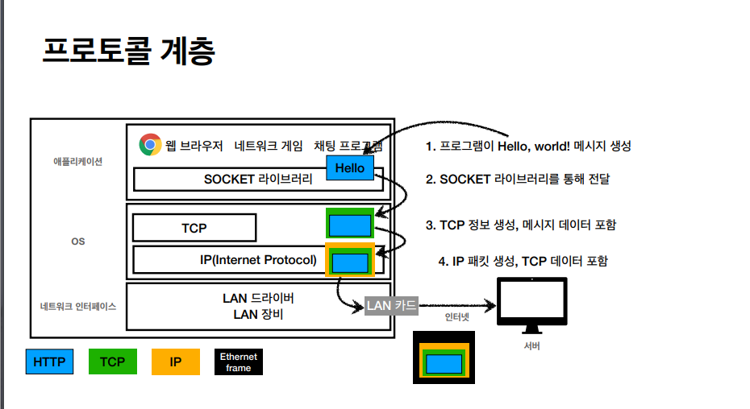
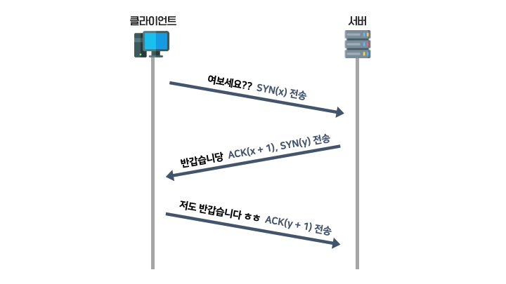

# TCP, UDP

## 인터넷 프로토콜 스택의 4계층

---
**애플리케이션 계층 - HTTP, FTP**
**전송계층 - TCP, UDP**
**인터넷 계층 - IP**
**네트워크 인터페이스 계층**

- 녹색이 TCP정보(TCP 세그먼트). 이것을 메시지 데이터에 씌우고, 그 다음에 IP 정보를 씌운다. (IP 패킷 생성)
    - `packet`은 `package`(수화물), `bucket`(덩어리)를 합친말.
- 랜카드를 통해서 나갈 때 이더넷 프레임을 씌워서 나간다.
- 이더넷 프레임: mac주소 같은 물리적인 데이터들이 포함되어 있다.

## TCP/IP 패킷 정보

1. TCP: 출발지 Port, 목적지 Port, 전송 제어, 순서, 검증 정보...
2. IP: 출발지 IP, 목적지 IP, 기타...

## TCP 특징
전송 제어 프로토콜 (transmission control protocol)

- 연결 지향 (TCP 3 way handshake) (가상 연결)
- 데이터 전달 보증
- 순서 보장

- 신뢰할 수 있는 프로토콜
- 현재 대부분 TCP 사용

### TCP 3 way handshake

그림으로 대체

- connect 연결과정
- `SYN`: 접송 요청 (synchronize)
- `ACK`: 요청 수락

- 이렇게하면 서버도 클라이언트를 믿을 수 있고, 클라이언트도 서버를 믿을 수 있다.

- 연결이 되고나면 그다음에 데이터를 전송한다.
- 요즘에는 마지막 `ACK`를 보낼 때 데이터도 같이 전송한다.

- 여기서 중요한 것은 진짜로 연결된 게 아니라 개념적으로 연결한 것이다.(가상 연결)

### 데이터 전달 보증

1. 클라언트에서 서버로 데이터 전송
2. 서버가 클라이언트에게 데이터 잘 받았음 알려줌

### 순서 보장

1. 패킷1, 패킷2, 패킷3 순서로 전송
2. 패킷1, **패킷3**, 패킷2 순서로 도착
3. 서버가 클라이언트에게 **패킷2**부터 다시 보내라구 요구

이 모든 것이 가능한 이유는 TCP 정보 안에 전송제어, 순서, 검증정보가 포함되어 있기 때문이다.

## UDP 특징 (User Datagram Protocol)

기능이없다...

- 하얀 도화지에 비유
- 연결지향 - TCP 3 way handshake X
- 데이터 전달 보증 X
- 순서 보장 X

- 데이터 전달 및 순서가 보장되지 않지만, 단순하고 빠름
- IP와 거의 같다. +`PORT` +`체크섬` 정도만 추가됨.
- 어플리케이션 단계에서 추가 작업 필요
- 최근에 각광을 받고있음?
- 