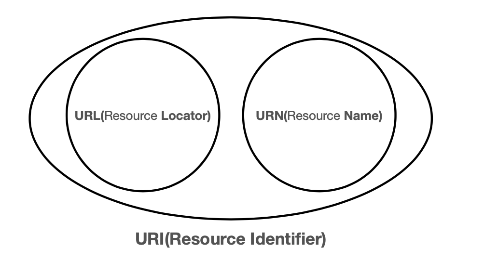

# URI

## URI (uniform resource identifier)

- URI : 리소스 식별자
- URL : 리소스 위치
- URN : 리소스 이름

- 거의 URL 만 쓴다.

## URI 단어 뜻

- Uniform: 리소스 식별하는 통일된 방식
- Resource: 자원, URI로 식별할 수 있는 모든 것(제한 없음)
- Identifier: 다른 항목과 구분하는데 필요한 정보

- URL: 리소스가 있는 위치를 지정
- URN: 리소스에 이름을 부여

- 위치는 변할 수 있지만, 이름은 변하지 않는다.
- URN 이름만으로 실제 리소스를 찾을 수 있는 방법이 보편화 되지 않음.
- 앞으로는 `URI`는 `URL`과 같은 의미로 이야기 한다.

### URL 분석

https://www.google.com:443/search?q=hello&hl=ko

- 프로토콜 (https) : 어떤 방식으로 자원에 접근할 것인가 하는 약속 규칙
- 호스트명 (www.google.com)
- 포트 번호 (443) : http는 보통 80 포트, 포트는 보통 생략 가능
- 패스 (/search)
- 쿼리 파라미터, 쿼리 스트링 (q=hello&hl=ko)
    - ?로 시작, &로 추가 가능
    - 쿼리스트링으로 불리는 이유는, 문자열로 전송되기 때문