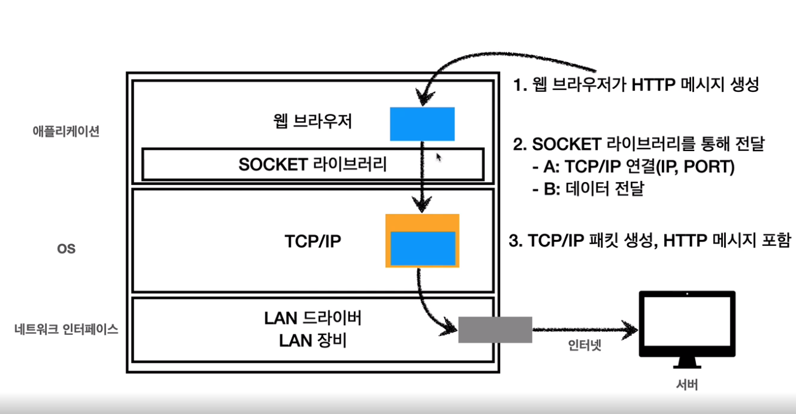

# 웹 브라우저 요청 흐름

1. DNS 조회
2. IP와 PORT 찾고
3. HTTP 요청 메시지 생성!

## HTTP 요청 메시지

```
GET /search?q=hello&hl=ko HTTP/1.1
Host: www.google.com
```

이렇게 생겼다. 이것이 전송데이터

## HTTP 메시지 전송



- 구글 서버가 이 요청 패킷이 도착하면 패킷을 까서 버리고
- HTTP 메시지(전송 데이터)를 분석

- 구글 서버에서 HTTP 응답 메시지 생성

```
HTTP/1.1 200 OK
Content-Type: application/json;charset=UTF-8 // text/html
Content-Length: 3333

<html>
    <body>...</body>
</html>
```

- 클라이언트는 또 응답패킷의 패킷을 까고 웹 브라우저가 HTML 렌더링을 한다.