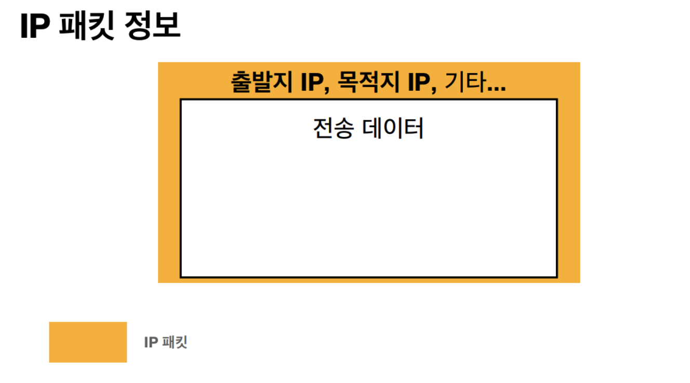
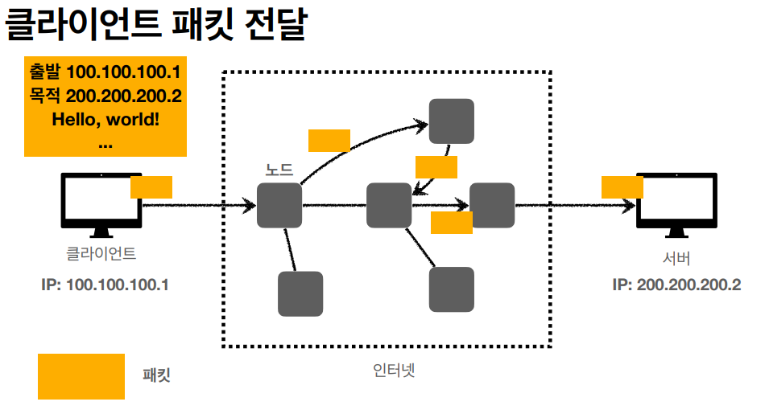
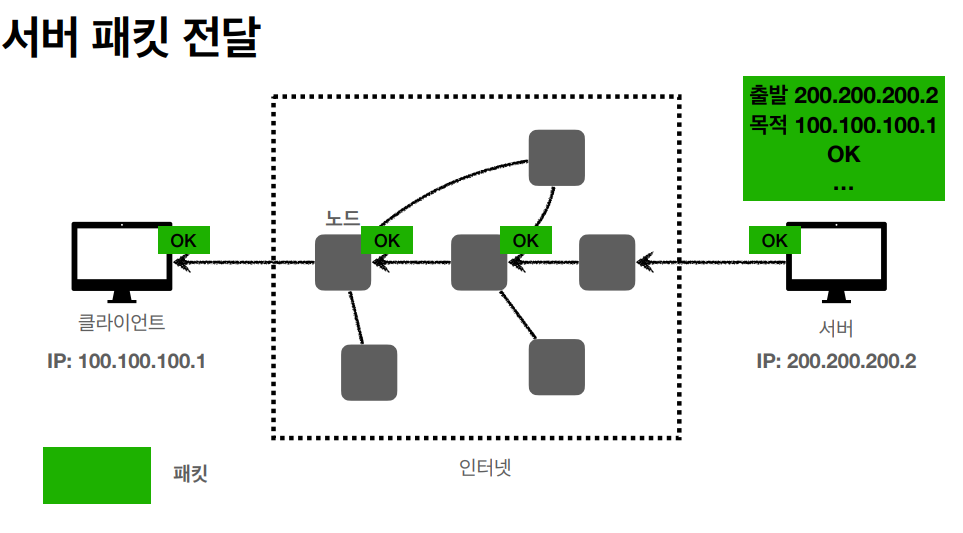

# 인터넷 통신과 IP Protocol

## IP (인터넷 프로토콜 혹은 아이피 프로토콜)

이 복잡한 인터넷 망에서는 최소한 규칙이 있어야겠지...

### 인터넷 프로토콜 (IP) 역할

- 지정한 IP 주소 (IP Address)에 데이터 전달
- 패킷(packet)이라는 통신 단위로 데이터 전달

---

### IP 프로토콜의 한계

- `비연결성`
    - 패킷을 받을 대상이 없거나 서비스 불능 상태여도 패킷 전송
    (대상 서버가 패킷을 받을 수 있는 상태인지 모름)
    (패킷 소실..., 소실되도 모름...)

- `비신뢰성`
    - 중간에 패킷이 사라지면???
    - 패킷이 순서대로 안오면???
    (Hello, World => World, Hello)

- `프로그램 구분`
    - 같은 IP를 사용하는 서버에서 통신하는 어플리케이션이 둘 이상이면???

### 이런 문제를 해결해주는 것이 TCP/UDP?