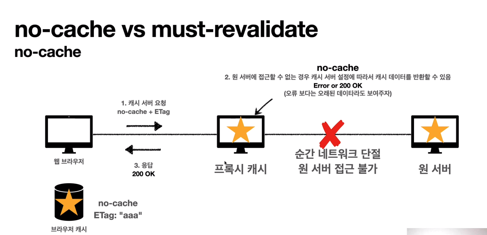
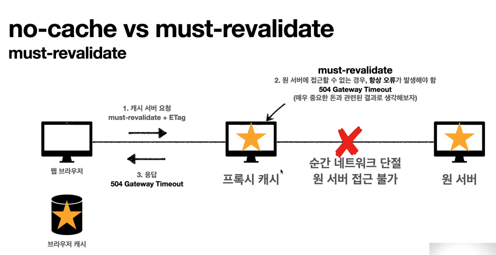

# 캐시 무효화

## Cache-Control 확실한 캐시 무효화 응답

- **Cache-Control: no-cache, no-store, must-revalidate**

- **Pragma: no-cache**
    - HTTP 1.0 하위 호환

## Cache-Control 캐시 지시어(directives) - 확실한 캐시 무효화

- __Cache-Control: no-cache__
    - 데이터는 캐시해도 되지만, 항상 **원 서버에 검증**하고 사용 (이름에 주의!)

- __Cache-Control: no-store__

    - 데이터에 민감한 정보가 있으므로 저장하면 안됨 (메모리에서 사용하고 최대한 빨리 삭제)

- **Cache-Control: must-revalidate**

    - 캐시 만료후 최초 조회시 **원 서버에 검증**해야함

    - 원 서버 접근 실패시 반드시 오류가 발생해야함 - **504(Gateway Timeout)**
    
    - `must-revalidate`는 캐시 유효 시간이라면 캐시를 사용함

- __Pragma: no-cache__

    - HTTP 1.0 하위 호환

## no-cache vs must-revalidate

