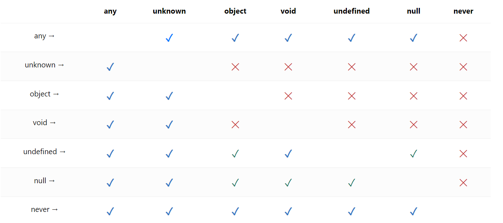

- 기본적으로 변수, 속성, 매개변수, 리턴값에 타입이 붙었다고 생각하면 됨.

```typescript
function add(x: number, y: number): number {
    return x + y;
}

const add2: (x: number, y: number) => number = (x, y) => x + y;

type Add = (x: number, y: number) => number;

const add3: Add = (x, y) => x + y;
```

- ts가 추론해주는 타입이 있는데 이런 건 그냥 그대로 사용하면 됨. ts가 추론하지 못하는 경우에만 직접 타이핑할 것.

- 최대한 타입스크립트가 지원해주는 타입을 믿어라.


- Tuple

```typescript
const arr: [number, number, string] = [123, 456, 'hello'];
```

- 고정된 원시값을 지정할 수 있다.

```typescript
const f: true = true;
const e: 'hello' = 'hello'
```


- 이런 경우도 있다.  강제 타입 지정?
```typescript
let aa = 123;
aa = 'hello' as unknown as number; // TS 에러가 사라진다
```

- `최대한 ! 대신 if를 쓸 것`

```typescript
// 뒤에 느낌표: null or undefined가 아님을 보증한다!
const head = document.querySelector('#head')!;
console.log(head);

const head = document.querySelector('#head');
if (head) {
  console.log(head);
}
```

- string과 String은 다름. 소문자로 하는 것 기억하기.

```typescript
const str: String = 'hello'; // Wrapper 객체
// 거의 안쓴다... 
// new String();
// string은 그냥 string으로 쓴다.
```

- 템플릿 리터럴 타입이 존재(유니언 등 사용 가능)

```typescript
type World = "world" | "hell";

// type Greeting = "hello world"
type Greeting = `hello ${World}`;

const c: Greeting = 'hell' 

// hello hell
// hello world
// 이 두개 자동 완성된다.

```

- rest 타입

```typescript
function rest(...args: string[]) {}
```

- 타입스크립트가 이런 사소한 단점도 있다.

```typescript
const tuple: [string, number] = ['1', 1];
tuple[2] = 'hello'; // 얘는 에러를 잡아준다.
tuple.push('hello'); // 하지만 얘는 에러를 안잡는다.
```


- enum

```typescript
// 잘 안쓴다.
const enum EDirection {
  Up, // 0
  Down, // 1
  Left, // 2
  Right, // 3
}
 
const ODirection = {
  Up: 0,
  Down: 1,
  Left: 2,
  Right: 3,
} as const;

// 이런식으로 상수로 쓸 수 있다.
// as const 때문에 readonly가 붙는다
// 물론 readonly는 내가 직접 사용해도 된다.
/*
const ODirection: {
    readonly Up: 0;
    readonly Down: 1;
    readonly Left: 2;
    readonly Right: 3;
}
*/
```

- keyof, typeof

```typescript
// keyof typeof ODirection: key들의 타입

// value들의 타입
type Direction = typeof ODirection[keyof typeof ODirection];
function run(dir: Direction) {}
```

- 유니언('|') 인터섹션('&')

```typescript
type A = { hello: 'world' } & { hi: 'there' }
const a: A = { hello: 'world', hi: 'there' }

// 유니언은 하나만 있으면 된다.
// 인터섹션은 모두 다 있어야 한다.
```

- 실제 사용 예 (상속의 개념으로 쓴다)

```typescript
type Animal = { breath: true };

type Poyouryu = Animal & { breed: true };

type Human = Poyouryu & { think: true };

const Paul: Human = { breath: true, breed: true, think: true };
```

- 보통은 간단하게 애플리케이션 만들 땐 `type alias`, 라이브러리들은 보통 `interface`

- `interface` 이런식으로 확장도 가능하다. (라이브러리 파보면 이런식으로 되어있는 경우가 있다.)

```typescript

interface A {
  sleep: () => void;
}

interface A {
  eat: () => void;
}

interface A {
  shit: () => void;
}

```

- 현업에서 `interface` 많이쓴다. 확장성 때문에!!!

- 타입스크립트에서 타입을 `집합`으로 생각하자. (좁은 타입과 넓은 타입)

- 비슷한 원리로 `any`는 전체집합, `never`는 공집합으로 볼 수 있다.

```typescript

type A = string | number;

type B = string;

type C = string & number;

A > B > C 순으로 넓다! (집합으로 생각)

```

- 객체로 따져보자

```typescript
type A = { name: string };
type B = { age: number };

type AB = A | B;

type C = A & B;

const c: C = { name: 'paul', age: 32 };

const ab: AB = c; // 가능

const abab: AB = { name: 'kang '};
const cc: C = abab; // 불가능

// 이 경우는 넓은타입에 좁은타입을 대입하지만 안된다.
// 객체 리터럴은 잉여 속성 검사를 한다.
const ccc: C = { name: 'paul', age: 32, married: false };

// Object literal may only specify known properties, and 'married' does not exist in type 'C'.ts(2322)
```

- 변수로 빼면 또 된다?

```typescript
interface A { a: string }
const obj = { a: 'hello', b: 'world' };

const obj1: A = obj;
```


- void

보통 리턴이 없는 함수나 `return;` 으로 끝나는 함수의 리턴 타입이 `void`

추가로 `return undefined;` 도 void 타입


- 함수의 매개변수, 특히 콜백함수에서의 리턴타입이 `void`이면 콜백함수의 리턴값이 존재해도 상관없다.

- 또, Method 함수의 리턴타입이 `void`인 경우도 상관없다.

```typescript
// 이런식으로 함수도 타입을 정의 할 수 있지만 구현부가 필요하다
// 구현부 없이 타입을 정의 하려면 `declare`를 앞에 붙여준다
declare function a(callback: () => void): void {

}

a(() => {
    return '3';
})

interface Human {
    talk: () => void;
}

const human: Human = {
    talk() {
        return 'say yes';
    },
}


```

- 그럼 왜 다르냐? 뭔 차이지?

그냥 함수에서의 void는 정말 리턴 값이 없다는 의미이고, 메소드나 매개변수에서의 void는 `"리턴값을 사용하지 않겠다"` 의 의미이다. 


- 타입만 선언하고 싶을 때 declare(구현은 다른 파일에 있어야 함)


```typescript
declare const a: string;
declare function a(x: number): number;
declare class A {}
```


- any, unknown

`any`는 타입선언을 포기하는 것이고 `unknown`은 지금 당장은 내가 타입을 모르겠지만 나중에 지정해서 쓸 것이다.

any보다는 낫다.

```typescript
interface A { 
    talk: () => void;
  }
  
  const a: A = {
    talk() { return 3; }
  }
  
  const b: unknown = a.talk();

  (b as A).talk();
```

- unknown 이 나오는 가장 흔한 경우가 try - catch 에서 에러 다룰 때

```typescript
try {

} catch (error) {
  (error as Error).message...
}
```

- 타입간 대입 가능표


초록색도 x라고 생각하면됨.
외울 필요 없음(vsc에서 다 제공)