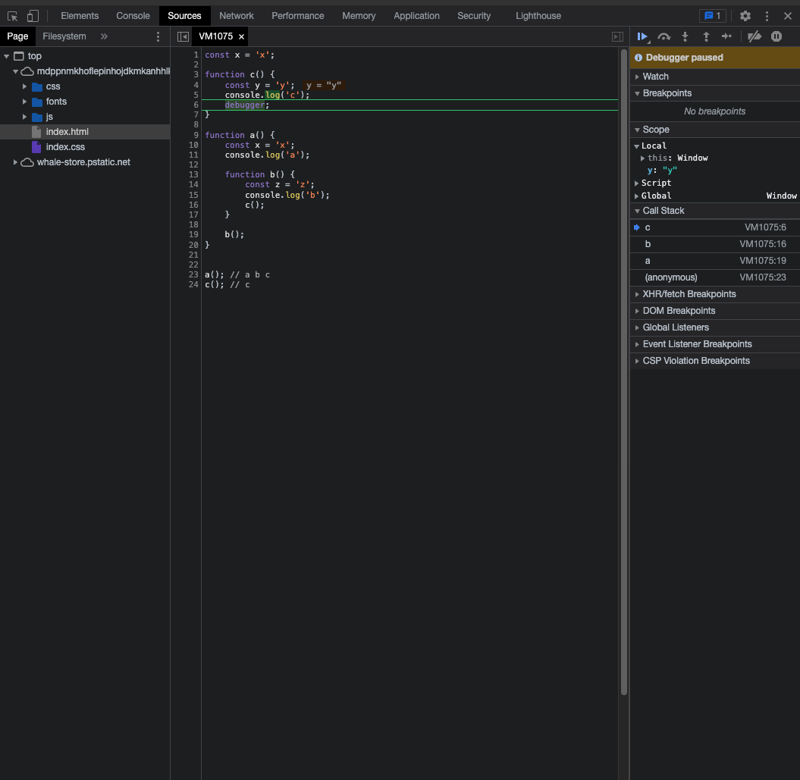

# 인간 js 엔진 되기 (고급 강좌)

## 1.1 함수와 함수의 호출, 고차함수

함수의 호출은 return 값으로 바로 대체해서 생각하기! (말이 되는 코드인지 살펴봐라)

```javascript
const onclick = () => {
  return (event) => {
    console.log("hello world~")
  }
}

document.querySelector("#header").addEventListener("click", onclick())
```

- 가능한 코드
- 함수안에서 다른 함수를 리턴한다 => `고차함수`

## 1.2 자바스크립트 스펙 외우지 마라

## 1.3 호출 스택 분석 (call stack)

```javascript
const x = "x"

function c() {
  const y = "y"
  console.log("c")
  debugger
}

function a() {
  const x = "x"
  console.log("a")

  function b() {
    const z = "z"
    console.log("b")
    c()
  }

  b()
}

a() // a b c
c() // c
```

- 호출 스택 그려보기!
- 함수의 닫는 중괄호 ('}')를 만나면 스택에서 빠져 나간다!
- 디버거 적용해서 브라우저 상에서 호출 스택 보기
  

## 1.6 this는 호출 때 결정된다고!!!

```javascript
const obj = {
  name: "paulkang",
  sayName() {
    console.log(this.name)
  },
}

obj.sayName() // paulkang

const sayN = obj.sayName

sayN() // undefined
```

```javascript
const obj = {
  name: "paulkang",
  sayName() {
    console.log(this.name) // paulkang
    function inner() {
      console.log(this.name) // undefined
    }
    inner()
  },
}

obj.sayName()

// scope chain
// inner -> sayName -> anonymous(window)
```

- sayName 화살표 함수로 바꾸면?

```javascript
const obj = {
  name: "paulkang",
  sayName: () => {
    console.log(this.name) // undefined
    function inner() {
      console.log(this.name) // undefined
    }
    inner()
  },
}

obj.sayName()

// scope chain
// inner -> sayName -> anonymous(window)
```

- this는 호출할 때 정해진다!
- new 연산자 (생성자), object의 메소드인 경우 this가 바뀐다 (new 연산자인 경우는 인스턴스 객체, object인 경우는 리터럴 객체)
- 화살표 함수는 부모함수의 this를 가져온다! (부모함수가 어떻게 호출되었는지를 봐야한다!)
- 호출스택을 그릴 때 this를 결정한다. (호출 스택을 그려보면서 this도 결정해보자)

```javascript
const obj = {
  name: "paulkang",
  sayName() {
    console.log(this.name) // paulkang // this: obj
    const inner = () => {
      console.log(this.name) // paulkang // 화살표 함수에서의 this는 부모함수의 this: obj
    }
    inner()
  },
}

obj.sayName()
```

```javascript
const obj = {
  name: "paulkang",
  sayName() {
    console.log(this.name) // paulkang
    function inner() {
      console.log(this.name) // undefined // 화살표 함수가 아니므로 this: window
    }
    inner()
  },
}

obj.sayName()
```

## 1.7 this를 분석할 수 없는 케이스

```javascript
const header = document.querySelector(".MainPage__SectionTitle")

header.addEventListener("click", function () {
  console.log(this)
})
// this는 window 환경이 아니다
// <h3 class="MainPage__SectionTitle">공지사항</h3>
```

- this는 호출할 때 결정된다 !!!!!!!!!
- 이벤트 핸들러의 콜백함수는 선언된 것!!! 호출 x
- 이런 경우는 외워야 한다

- addEventListener 추측해보기

```javascript
const header = {
  addEventListener: function (eventName, callback) {
    callback() // this가 window => 땡
    callback.call(this) // this가 header(호출의 주체가 header이므로) <= 아마 이런식으로 구성되어 있을 것이다
  },
}

header.addEventListener("click", function () {
  console.log(this)
})
```

- 화살표 함수로 바꿀 시

```javascript
header.addEventListener("click", () => {
  console.log(this) // Window
})
```

- 콜백함수의 부모함수는 ?
- addEventListener가 아니다
- 선언과 호출을 구분하자 !!!! (addEventListener는 호출)
- 콜백함수의 부모함수는 anonymous (Window)

- 다시한번 강조! **this는 호출할 때 결정된다!!!**

- bing, apply, call

```javascript
;(a.apply(obj) === a.bind(obj)()) === a.call(obj)
```

- bind는 호출이 아니다
- apply, call 의 차이

```javascript
function add(a, b) {
  return a + b
}

add.apply(null, [3, 5]) // 8
add.call(null, 3, 5) // 8
```

## 2.1 프로미스의 최고 장점을 아십니까

- 실행되었는데 결과값을 **나중에 쓸 수 있다!**

- 콜백은 비동기일수도 아닐수도 (비동기 콜백이 비동기)

- **callback hell 이 왜 안좋아요? 에 대한 대답!**

결과값을 바로 받아야 하기 때문에!

**예시**

```javascript
axios.get("url1", function (data1) {
  axios.get("url2", function (data2) {
    axios.get("url3", function (data3) {
      // ...
    })
  })
})
```

나중에 써도 된다!

```javascript
const p1 = axios.get("url1")
const p2 = axios.get("url2")
const p3 = axios.get("url3")
const p4 = axios.get("url4")
const p5 = axios.get("url5")
const p6 = axios.get("url6")

Promise.all([p1, p2, p3, p4, p5, p6])
  .then((results) => {})
  .catch((error) => {})
```

- 하나라도 문제가 되면 catch 절로 가버린다
- 전부 다 취소했다가 다시 시도해야 한다

✍🏻 **NOTE**

> 입력 값으로 들어온 프로미스 중 하나라도 거부 당하면 Promise.all()은 즉시 거부합니다.
> 이에 비해, Promise.allSettled()가 반환하는 프로미스는 이행/거부 여부에 관계없이 주어진 프로미스가 모두 완료될 때까지 기다립니다.
> 결과적으로, 주어진 이터러블의 모든 프로미스와 함수의 결과 값을 최종적으로 반환합니다.

```javascript
// 송금이라 치면

const p1 = axios.get("url1") // 송금 성공
const p2 = axios.get("url2") // 송금 성공
const p3 = axios.get("url3") // 송금 성공
const p4 = axios.get("url4") // 송금 성공
const p5 = axios.get("url5") // 송금 실패
const p6 = axios.get("url6") // 송금 성공

Promise.allSettled([p1, p2, p3, p4, p5, p6])
  .then((results) => {
    // 실패한 것만 필터링해서 다시 시도하면 되게끔 할 수 있다
  })
  .catch((error) => {})
```

- 그래서 내 사전에 `Promise.all` 은 없다!

## 2.2 비동기는 동시의 문제가 아니다. 순서의 문제다.

- 한번 비동기는 영원한 비동기 !
- 스펙대로 공부하는게 꼭 좋은 것이 아니다. (효율적으로 공부하자)

- 이벤트루프 관련 용어들 (콜스택, 이벤트루프, 백그라운드(BG), 매크로 태스크 큐, 마이크로 태스크 큐)

- BG(백그라운드)는 자바스크립트 엔진(혹은 운영체제) 라고 생각하자. (실제로 존재하는 공간은 아니다)
- BG는 **동시에** 무언가를 할 수 있다?
- setTimeout의 timer들은 BG에 들어간다. (Promise, ajax 요청, 이벤트리스너)
- 비동기는 백그라운드를 거친다고 생각하자.

- 그림 그려가면서 공부하기

## 2.3 한 번 비동기는 영원한 비동기

- **M (매크로) 태스크 큐**
- **m (마이크로) 태스크 큐**에는 promise랑 process.nextTick

- 나머지는 **매크로 태스크 큐**

- 마이크로 태스크 큐에 있는 것들을 먼저 콜스택으로 올린다.
- 마이크로 태스크 큐가 꽉 차있으면 영원히 매크로태스크는 실행이 안되게 됩니다.

```javascript
setTimeout(() => {
  console.log("a")
}, 0)

setTimeout(() => {
  console.log("b")
}, 1000)

setTimeout(() => {
  console.log("c")
}, 2000)

Promise.resolve().then(() => {
  console.log("Promise Task is first! (Micro Task)")
})

/**
    Promise Task is first! (Micro Task)
    a
    b
    c
*/
```

**비동기 간에는 순서가 헷갈리는 일을 만들지 마라**
ex)

```javascript
setTimeout(() => {
  console.log("a")
}, 0)

setTimeout(() => {
  console.log("b")
}, 0)

setTimeout(() => {
  console.log("c")
}, 0)

// a b c
```

이렇게 쓸 바에 다음과 같이 쓰는게 낫다

```javascript
setTimeout(() => {
  console.log("a")
  console.log("b")
  console.log("c")
}, 0)
```

- 다시 한번 강조! **한번 비동기는 영원한 비동기**

```javascript
let a = 2
setTimeout(() => {
  a = 5
  console.log(a)
}, 0)

console.log(a) // 2 여기서 a = 5 인 경우를 생각할 수 없다!!!
```


## 2.4 Promise에도 동기 부분이 있다!

```javascript
let a = 2;

const p = new Promise((resolve, reject) => {

    // 여기 동기다. 제일 먼저 실행
    console.log('여기 동기 제일 먼저') 

    setTimeout(() => {
        a = 5;
        console.log(a);
        resolve(a);
    }, 0);
})
console.log('딴짓 딴짓')
console.log(a);


p.then((result) => console.log("result: " + result));

/*
<output>

여기 동기 제일 먼저

딴짓 딴짓 ​​​​​

2 ​​​​​

5 ​​​​​

result: 5 

*/


// Promise란, 실행은 바로 하되, 결괏값을 나중에 원할 때 쓸 수 있는 것!
```

- new Promise 안의 익명함수, 함수 호출문이 아니지만 먼저 호출된다.
- 이런 걸 외워야 한다.

```javascript
(resolve, reject) => {

    // 여기 동기다. 제일 먼저 실행
    console.log('여기 동기 제일 먼저') 

    setTimeout(() => {
        a = 5;
        console.log(a);
        resolve(a);
    }, 0);
}
```

- 백그라운드는 특정 조건이 만족했을 때 매크로 큐나 마이크로 큐로 보낸다.
- `setTimeout`의 특정 조건은 시간이 지났을 때
- `Promise`의 조건은 `resolve` 함수가 호출되었을 때


## 2.5 async/await, Promise로 바꾸기

```javascript
p.then((result) => {
    console.log("result: " + result);
    return Promise.resolve(1);
}).then(result => {
    console.log(result);
    return undefined;
}).then(result => {
    console.log(result);
    return 1;
}).then(result => {
    console.log(result);
}).catch(() => {

}).then(() => {
    
})
```

- `Promise`가 resolve된 값이 result로 넘어간다.
- `Promise`가 아닌 일반 값은 그냥 result로 넘어간다.


```javascript
async function aaa() {
    const a = await Promise.resolve(1);
    const b = await 1;
    console.log(a); // 1
    console.log(b); // 1
}

aaa();
```

- `await`이 기준

- `Promise.resolve(1)` <- 프로미스화 


```javascript
async function a() {
    const a = await 1;
    console.log('a', a);
    console.log('hmmmm');

    await null;
    const b = await Promise.resolve(1);
    console.log('b', b);
}

a();

/*
a 1

hmmmm

b 1
*/


Promise.resolve(1)
    .then((a) => {
        console.log('a', a);
        console.log('hmmmm');
        return null;
    })
    .then(() => {
        return Promise.resolve(1);
    })
    .then((b) => {
        console.log('b', b);
    })
```


## 2.6 무지성 await 연달아쓰기 금지!


```javascript
function delayP(ms) {
    return new Promise((resolve, reject) => {
        setTimeout(resolve, ms);
    })
}

async function a() {
    console.log(3000);
    await delayP(3000);
    console.log(6000);
    await delayP(6000);
    console.log(9000);
    await delayP(9000);

    // 토탈 18초
}

a();

async function b() {
    const p1 = delayP(3000); // 3sec
    const p2 = delayP(6000); // 6sec

    await Promise.allSettled([p1, p2]); // 6sec
    await delayP(9000); // 9sec

    // total 15sec
    // 무지성 await 쓰기 금지!
    // 동시에 진행시켜도 되는것들을 무지성 await을 때문에 응답시간을 지연시키지 말자.
}

b();

// Promise: 실행은 바로. 결괏값은 나중에 원할 때 쓸 수 있는 것!
```

- Promise란, 실행은 바로 하되, 결괏값을 나중에 원할 때 쓸 수 있는 것

- 실행은 바로 ---> 결괏값이 나올 때는 나중 ---> 결괏값을 사용할 때는 더 나중

- 실행은 바로 ---> 결괏값도 거의 바로 쓰고 싶은데 ---> 그 다음에 결괏값이 나오면 ---> then, await, Promise.all 이런게 결괏값을 기다린 후에 실행된다!


## 2.7 프로미스 다양한 활용

- async Promise.then으로 바꾸기
```javascript
async function b() {
    const p1 = delayP(3000); // 3sec
    const p2 = delayP(6000); // 6sec

    await Promise.all([p1, p2]); // 6sec
    await delayP(9000); // 9sec

    // total 15sec
}

// async -> Promise.then 으로 바꾸기


new Promise((resolve, reject) => {
    const p1 = delayP(3000);
    const p2 = delayP(6000);
    return Promise.all([p1, p2]);
})
.then(() => {
    return delayP(9000);
})
.then(() => {
    
})
```


- 동시에 조작? 순서대로 조작?

```javascript
const p1 = Promise.resolve(1);
const p2 = Promise.resolve(1);
const p3 = Promise.resolve(1);

// 동시에 하고싶다면 이렇게
const results = await Promise.all([p1, p2, p3]);


for (let result of results) {
    await result조작(); // p1 끝난 후 p2, p2 끝난 후 p3
}
```